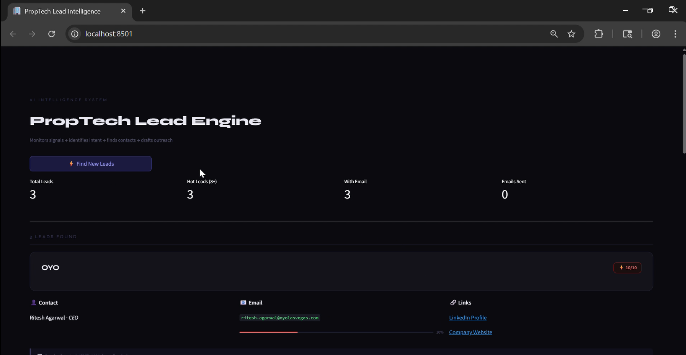
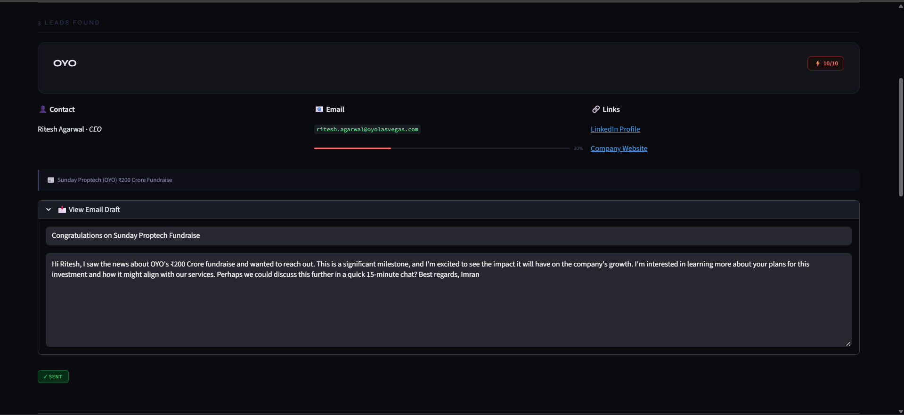

# 🏢 PropTech Lead Intelligence System

An end-to-end AI agent that monitors PropTech news in real time, identifies high-intent buying signals, finds decision-maker contacts, generates personalized outreach emails, and lets you send them — all from a single dashboard.

---





## What It Does

Most sales teams spend hours manually scanning news, finding contacts, and writing cold emails. This system automates the entire workflow in one pipeline run.

```
RSS Feeds → Signal Filter → LLM Classification → Contact Finder → Email Writer → Dashboard
```

1. **Monitors** PropTech RSS feeds for funding rounds, product launches, acquisitions, and expansion news
2. **Classifies** each signal using an LLM — YES (strong signal), MAYBE, or NO — with an urgency score from 1–10
3. **Finds** the company's decision-maker on LinkedIn (CEO, Founder, CTO) and their official website
4. **Discovers** contact email by generating patterns and verifying each one via Hunter.io
5. **Writes** a personalized cold email (subject + body) tailored to the specific news signal
6. **Displays** all leads in a clean dashboard where you can review, edit, and send emails directly

---

## Tech Stack

| Layer | Technology |
|---|---|
| Orchestration | LangGraph (stateful agent graph) |
| LLM | Groq — `llama-3.3-70b-versatile` |
| News Fetching | feedparser + BeautifulSoup |
| Contact Finding | DuckDuckGo Search (DDGS) |
| Email Verification | Hunter.io API |
| Deduplication | RapidFuzz fuzzy matching |
| Scheduling | APScheduler |
| Dashboard | Streamlit |
| Storage | Excel (openpyxl) + JSON cache |

---

## Project Structure

```
├── main.py                  # LangGraph pipeline — orchestrates all agents
├── app.py                   # Streamlit dashboard
├── run_daily.py             # Scheduler — runs pipeline daily at 9 AM IST
│
├── source/
│   └── news_finder.py       # RSS fetcher, keyword filter, deduplication
│
├── agents/
│   ├── intent_classifier.py # LLM signal classifier + email writer
│   └── contact_finder.py    # LinkedIn scraper + email pattern verifier
│
└── data/
    ├── leads.xlsx            # All saved leads
    ├── cache_leads.json      # Contact cache — avoids re-searching companies
    └── seen_signals.json     # Seen articles — avoids reprocessing old news
```

---

## Agent Pipeline (LangGraph)

```
fetch_signals
      ↓
get_next_signal ──── (no signals left) ──→ export_excel → END
      ↓
   classify
      ↓
  intent_router
   ↙         ↘
find_contact  skip
      ↓
generate_email
      ↓
 save_lead
      ↓
get_next_signal  (loop)
```

Each node is a pure function. LangGraph manages state across the loop — signals list, current signal, classification result, contact, email draft, and accumulated leads all travel through the graph as typed state.

---

## Key Features

**Smart Signal Detection**
- Keyword-based pre-filter before LLM call to reduce API usage
- `token_sort_ratio` fuzzy dedup so "Zillow launches app" and "App launched by Zillow" aren't processed twice
- First run fetches full feed history; reruns fetch only the last 48 hours of new signals
- Seen signals persisted to disk — zero overlap across daily runs

**LLM Classification**
- Structured output via Pydantic schema — LLM always returns valid JSON
- Classifies intent as YES / MAYBE / NO with a reason and urgency score
- Extracts company name, filters out events and conferences automatically
- Fallback schema returned on API failure — pipeline never crashes

**Contact Finding**
- Searches LinkedIn via DuckDuckGo dorks — no LinkedIn API needed
- Priority order: CEO → Founder → Co-Founder → CTO → President → MD
- Finds official company website with blocked-domain filtering
- All contacts cached to JSON — same company never searched twice

**Email Verification**
- Generates 6 common patterns: `first.last@`, `firstlast@`, `flast@`, `first@`, `last@`, `f.last@`
- Verifies each pattern via Hunter.io email-verifier (not guesser) — uses fewer API credits
- Falls back to best-guess pattern with low confidence if none verify
- Name parts stripped of punctuation before pattern generation

**Outreach Email Generation**
- LLM writes subject + body for every YES lead regardless of email confidence
- Prompt instructs the model to write like a human, reference the specific news, stay under 120 words
- Emails are editable in the dashboard before sending

**Dashboard**
- Live metrics — total leads, hot leads (8+), leads with email, emails sent
- Per-lead cards with contact info, confidence bar, signal summary, editable email draft
- Individual send + bulk send with progress bar and per-lead failure messages
- Download all leads as a dated Excel file

---

## Setup

**1. Clone and install dependencies**
```bash
pip install -r requirements.txt
```

**2. Create `.env` file**
```env
GROQ_API_KEY=your_groq_api_key
HUNTER_API_KEY=your_hunter_api_key
EMAIL=your_gmail@gmail.com
PASSWORD=your_gmail_app_password
RUN_HOUR=9
RUN_MINUTE=0
RUN_TIMEZONE=Asia/Kolkata
```

**3. Run the dashboard**
```bash
streamlit run app.py
```

**4. Or run the pipeline once directly**
```bash
python run_daily.py --run-once
```

**5. Start the daily scheduler**
```bash
python run_daily.py
```

---

## Scheduler Flags

```bash
python run_daily.py                  # Run now + schedule daily
python run_daily.py --no-initial-run # Schedule only, skip startup run
python run_daily.py --run-once       # Run once and exit (testing)
```

---

## Environment Variables

| Variable | Description | Default |
|---|---|---|
| `GROQ_API_KEY` | Groq API key for LLM | Required |
| `HUNTER_API_KEY` | Hunter.io for email verification | Optional |
| `EMAIL` | Gmail address to send from | Required for sending |
| `PASSWORD` | Gmail app password | Required for sending |
| `RUN_HOUR` | Hour to run daily (24hr) | `9` |
| `RUN_MINUTE` | Minute to run daily | `0` |
| `RUN_TIMEZONE` | Timezone for scheduler | `Asia/Kolkata` |

---

## How Leads Are Scored

| Score | Signal Type |
|---|---|
| 9–10 | Major funding round or acquisition |
| 7–8 | Market expansion or growth announcement |
| 4–6 | Product launch or moderate signal |
| 1–3 | Weak signal or general announcement |

Leads scoring 8+ are considered hot leads and highlighted separately in the dashboard metrics.

---

## Built With

- [LangGraph](https://github.com/langchain-ai/langgraph) — agent orchestration
- [Groq](https://groq.com) — fast LLM inference
- [Hunter.io](https://hunter.io) — email verification
- [Streamlit](https://streamlit.io) — dashboard
- [DuckDuckGo Search](https://pypi.org/project/ddgs/) — contact discovery